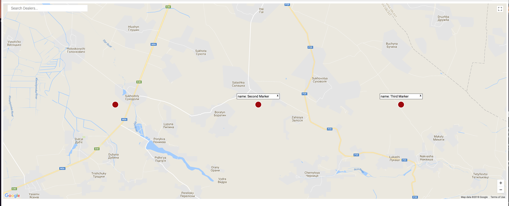
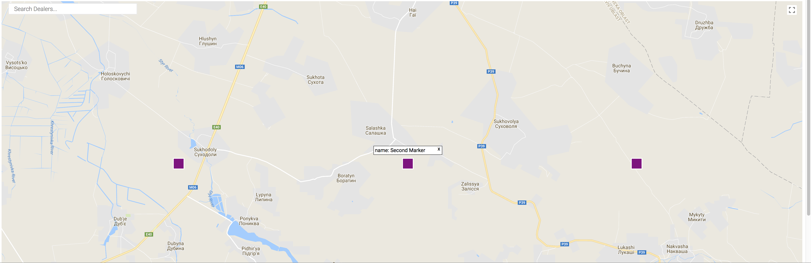
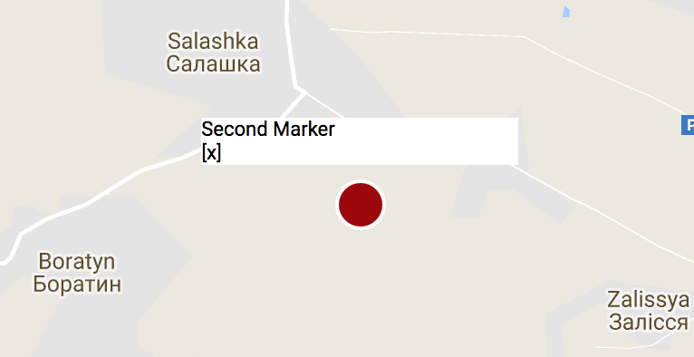
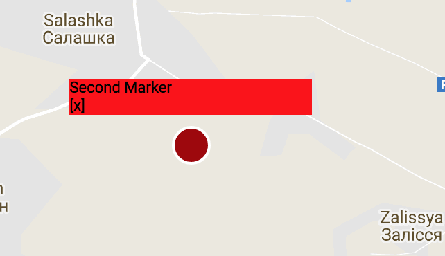
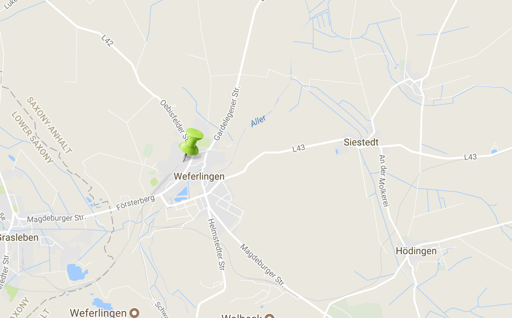
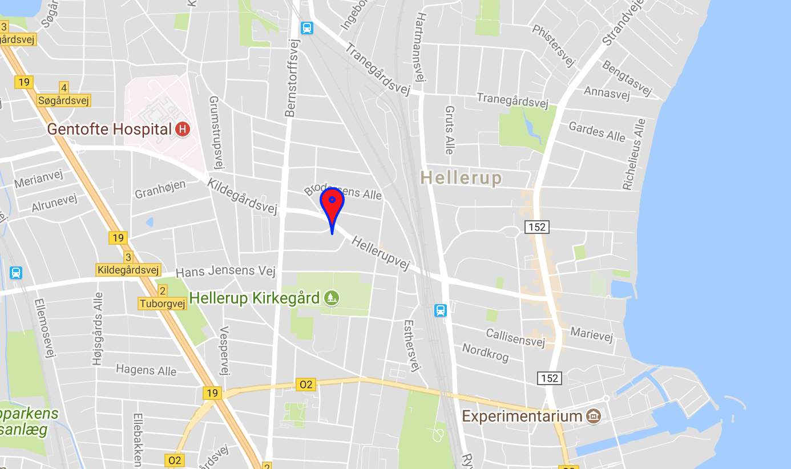
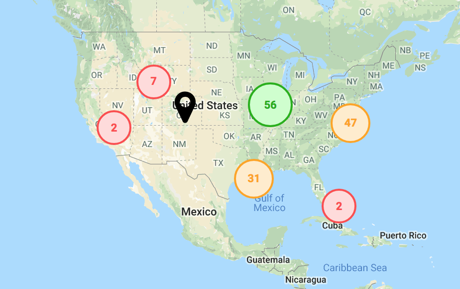

# React Store Locator

If you find any bugs/issues please tag me in them :D. Also feel free to recommend something you want or do a PR and inlcude a demo or testing of some sort and I'll accept it. Try not to break the main func of the module though.

Newest features will be added to the bottom of the readme for now. If you would like to re-write and update readme please let me know. Demos also need to be updated as well. I believe there are issues in the github if you wish to tackle them just do a PR :D.

## Demo

[Demo](https://react-store-locator-demo.netlify.com/)

[Demo Github](https://github.com/escaladesports/react-store-locator-demo)

## Short Description

This module is used for when you have a list of stores/locations that you wish to put on a map and show information about each store/location.

## Getting started

```bash
yarn add react-store-locator

npm install --save react-store-locator
```

Make sure you have yarn installed if you wish to use it

## Usage

### Basic

```jsx
import { Map } from 'react-store-locator';

render(){
  const locations = [
    {
    id: 1,
    lat: 50,
    lng: 25.1,
    show: false,
    name: 'First Marker'
  },
  {
    id: 2,
    lat: 50,
    lng: 25.2,
    show: true,
    name: 'Second Marker'
  },
  {
    id: 3,
    lat: 50,
    lng: 25.3,
    show: true,
    name: 'Third Marker'
  }
  ]
  return(
    <Map locations={locations} googleApiKey={'Your Key Here'}/> // Pass google maps api key through here
  )
}
```

Note: The map seems to work without a key ( you will get a warning ). Without a key you also may recieve less request than with a key. This is up to you.

Default map:



This will show a map with default markers and default info windows.

You will need to include all of these props for a minimum for each of your stores/locations. If you wish your information to `show` by default then set `show` to true otherwise set `show` to false.

By default the map will have a height of 800px and width of 100%. You can change these by passing through these values as props.

```jsx
//...
<Map height={'1000px'} width={'800px'}>
```

### Start customizing

You can add your own custom pin and information window. Examples below.

#### Pin

Adding your own pin is super easy and with little set up you can have an awesome looking pin.

UPDATE: I ran into a problem in react when needing to pass down local props to my pin. In order to tackle this I added an update to let you pass an object instead of just the pin component (see below). In your component you should just be able to now use those local props with either props.pinProps or this.props.pinProps depending if you are using a class based component or functional based component.

We will pass through a function called `handleLocationClick` through props. If you wish to use the toggle feature for the `Info` window you will want to attach this to the parent element of your pin. If you wish for only a certain part of your pin to work then add it to that element. Make sure you pass through the id so the correct window will be toggled.

You will also need to pass through the children through the inside of your component, this way you can render the `Info` component. Style this component however you like or add an image instead.

Make sure you include the function `handleLocationClick` and pass through `id`.

Note: If you are using a class based component then you will use `this.props...` instead.

```jsx
//...
const myPin = (props) => (
      <div
        style={{
          cursor: 'pointer',
          backgroundColor: 'purple',
          height: '25px',
          width: '25px',
          border: '2px solid white'
        }}
        onClick={() => props.handleLocationClick(props.id)}
      >
        {props.children}
      </div>
)

<Map locations={locations} pin={myPin}>

// With pin props

<Map locations={locations} pin={{component: myPin, pinProps: myPinProps}}>
```

Custom Pin:



#### Info

```jsx
import { Info } from 'react-store-locator'

//...

return (
	<Map locations={locations}>
		{(location, closeLocation) => {
			return (
				<Info show={location.show}>
					<div style={{ background: 'red' }}>
						{location.name}
						<div onClick={() => closeLocation(location.id)}>[x]</div>
					</div>
				</Info>
			)
		}}
	</Map>
)
```

`closeLocation` is a function that you must call on whatever you wish to close the `Info` window. Above we wrap `[x]` inside a div and apply an onClick to this div. When you click this it will close the `Info` window. We recommend adding a style of `cursor`: `pointer` to this element as well to make it more obvious that it does close the `Info` window.

You must pass `show` prop through the `Info` component if you want your info window to work correctly. Pass any jsx through the `Info` tag and it will be displayed. There you can style this however you wish.

Without any styles:



With styles:



If you want to change the size of the window itself please pass through a style object through as a prop into `Info`. The style prop of the `Info` window will take three props.

```jsx
//...
const infoStyle = {
  width: '150px',
  height: '30px',
  backgroundColor: 'yellow',

}
<Info show={location.show} style={infoStyle}>
// Content here
</Info>


// If not using custom Info component

<Map locations={locations} infoStyle={infoStyle} />
```

## Other Features included

### Search

There will be a custom search bar to search your map. This will recenter and zoom the map to what location you search. It will place a google marker, that you can customize how you like, on your current location.

Note: on map load there will not be a current location marker until you search, also when you search a new location your old marker will disappear.

### Custom Search

As of version `0.5.0` there will now be a `Search` component you can bring in. This will allow you to have your own input and call it anywhere in your project. It should have the autocompletion and once searched update your map as well.

There are two props you can pass through: `style`, `placeholder`. The style prop passes through a react `style` object and `placeholder` takes a string. The className is `storeLocatorSearchInput` if you wish to use pure css instead.

```jsx
import { Search } from 'react-store-locator';

//...
render(){
  return(
    <div>
      <Map
      //  any props being called here
       />
       <Search
        style={{background: 'red', color: 'blue', textTransform: 'uppercase'}}
        placeholder={'Fly to your location'}
       />
    </div>
  )
}
```

### Initial map location

```jsx
import { Map } from 'react-store-locator';
//...
<Map
  initSearch={'Any search string here'} // Can take any search string and will load map with this value
>
```

### Adding Map styles

You can pass through map style like so:

```jsx
<Map mapStyle={mapStyleObject} />
```

This uses a JSON object from https://mapstyle.withgoogle.com/. You can go here and copy and paste this through the `mapStyle` prop.

### Adding custom google map Icons or customizing the default Icon

```jsx
//...

<Map
searchMarker={{icon: 'image path here', path: 'svg path here', color: 'fill color'}}
>
```

Note: If you include both an `icon`, `icon` will render first. If no props are passed it will default to the default marker.

The `icon` takes an image url. You can also pass a local image through if you just import it like so:

```jsx
import image from '../img/myimage.png';
//...

<Map searchMarker={{icon: image} />;
```

With custom image:



The `customIcon` is google's default icon, but you can change the `color`, and `path`. If you do not include one of these props then it will have a default so do not worry.

(From a stackoverflow post about this topic)
You can also create the paths using a visual tool like https://inkscape.org/en/ (GNU-GPL, multiplatform). Some useful hints:

1. Google API just accepts a single path, so you have to turn any other object (square, cercle...) into a path and join them as a single one. Both commands at the Path menu.
2. To move the path to the (0,0), go to the Path Edit mode (F2) select all the control nodes and drag them. Moving the object with F1, won't change the path node coords.
3. To ensure the reference point is at (0,0), you can select it alone and edit the coords by hand on the top toolbar.
4. After saving the SVG file, which is an XML, open it with an editor, look for the svg:path element and copy the content of the 'd' attribute.

With custom icon:



### Grabing stores/locations within window

This is a feature that is very useful when wanting to get information about the locations in your current window.

You will pass through a function through the `onChange` props and pass through `locations` as param. The function will be called on map load and any other time you move the map.

Note: If you cover part of your map this will still count markers that you may end up covering. If this is the case, it would be best to resize your map instead.

#### New feature for this "feature"

The returned stores/locations now will have a `distanceFromCenter` prop that will tell you the distance in miles they are from the center of your map. This way you can tell your user how far each store/location is.

```jsx
//...

onChange(locations) {
 console.log(locations) // locations inside of current window
}

<Map onChange={this.onChange}>
```

### Autocomplete Input

This will not update the map at all. This input is strictly for returning a location object and having google's autocomplete functionality.

All the props are listed below. You can also use pure css to style if you wish by targeting the class `storeLocatorAutocomplete`.

`customOptions` can be used to set custom options, check [google Autocomplete doc](https://developers.google.com/maps/documentation/javascript/places-autocomplete#add_autocomplete) for available options.

Note: This is a seperate component from the map so you should pass your api key in here as well if you wish to use this.

```jsx
import { AutoComplete } from 'react-store-locator';

myFunc(value){
  console.log(value) // place object returned
}

render(){
  return(
    <div>
      <AutoComplete
        style={{color: 'red'}}
        getValue={this.myFunc.bind(this)}
        googleApiKey={'googleapikey'}
        placeholder="My placeholder string"
      />
    </div>
  )
}
```

### Control results returned on search

`customOptions` prop can be used on `Map`, `Search` and `AutoComplete` component to customize the results returned by Google in the search fields, check [google Autocomplete doc](https://developers.google.com/maps/documentation/javascript/places-autocomplete#add_autocomplete) for available options.

Example with `AutoComplete` to display only results from France :

```jsx
import { AutoComplete } from 'react-store-locator';

myFunc(value){
  console.log(value) // place object returned
}

render(){
  return(
    <div>
      <AutoComplete
        style={{color: 'red'}}
        getValue={this.myFunc.bind(this)}
        googleApiKey={'googleapikey'}
        placeholder="My placeholder string"
        customOptions={{componentRestrictions: {country: 'fr'}}}
      />
    </div>
  )
}
```


### Center Marker on Move

This will put a marker in the center of the map when you move the map. If no props are passed it will default to the default marker.

```jsx
//...

<Map
centerMarker={{icon: 'image path here', path: 'svg path here', color: 'fill color'}}
>
```

### Submit search function for search callback

This will allow you to pass a function that will be called after a place has been found by the internal search that comes with the map.

```jsx
//...

function myFunc() {
  console.log('Found a location'); // should fire off once a new location has been found
}
<Map submitSearch={myFunc}>
```

### Map Loaded callback added

```jsx
//...

<Map mapLoaded={() => console.log('Map Loaded')}>
```

### Cluster Markers

default clusters:



This one is pretty simple to do as you already have almost all the knowledge of what to do. You will simply pass an object through the prop `clusterPin` and yes you can use your own react component for each of the clusters. There is a default however if you choose to opt that direction. Below is an example.

```jsx
<Map
	enableClusters={true} // this enables clusters to be used
	// clusterPin is how to pass a custom comp through
	clusterPin={{
		pinProps: { prop: `value` }, // just like in the pin these will be passed to your comp
		component: MyClusterPin // just like in the pin this is your custom comp
	}}
	//...
/>
```

If you choose to not go with the default (I would recommend creating your own cluster pin), then you will have to create a react comp and do a tiny bit of maintence to get the map to work correctly. I will break everything down so there are no loose ends.

```jsx
import React from 'react'

// Note this could be a class based comp or func comp
// I do believe react is going away from class based comp so we will use a func comp for this one

export default props => {
const {
	point_count, // amount of points in a cluster
	getZoom, // func to access the updated zoom of the cluster once clicked
	cluster_id, // cluster_id needed to pass to getZoom
	lat,
	lng,
	updateMap, // func to update the map
	pinProps // props passed to the comp by user
} = props

console.log(pinProps) // ==> will return {prop: `value`}

const size = point_count > 30 `large` : point_count > 20 ? `medium` : `small` // changing style of cluster
const styles = {
	cluster: {
		cursor: `pointer`,
		borderRadius: `50%`
	},
	large: {
		background: `#ccffcc`,
		border: `2px solid #00b200`,
		color: `#00b200`,
		height: `45px`,
		width: `45px`
	},
	medium: {
		background: `#ffedcc`,
		border: `2px solid #ffa500`,
		color: `#ffa500`,
		height: `40px`,
		width: `40px`
	},
	small: {
		background: `#ffdbdb`,
		border: `2px solid #ff4c4c`,
		color: `#ff4c4c`,
		height: `35px`,
		width: `35px`
	},
	pointCount: {
			position: `relative`,
			top: `50%`,
			transform: `translateY(-50%)`,
			textAlign: `center`,
			fontWeight: `600`
		}
}
return (
	<div
		style={{ ...styles.cluster, ...styles[size] }}
		onClick={() => {
			// updating the map to the correct zoom and center
			// THIS IS REQUIRED FOR THE MAP TO UPDATE CORRECTLY!!!

			updateMap({
				zoom: getZoom(cluster_id),
				center: { lat, lng }
			})
		}}
	>
   <div style={styles.pointCount}>{point_count}</div>
	</div>
	)
}

```
